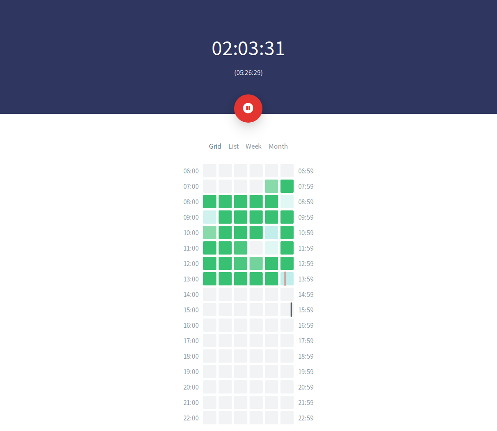
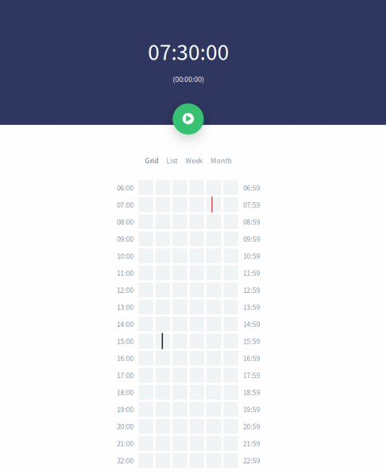

# Work Timer
My personal app for tracking work hours. Inspired by [100 blocks a day](https://waitbutwhy.com/2016/10/100-blocks-day.html) and [144 blocks](https://144blocks.com/).

## Development
- Install [Create ELM app](https://github.com/halfzebra/create-elm-app)
```bash
npm install create-elm-app -g
```
- Create [Toggl](https://www.toggl.com/) account and get `API Token` (under Profile Settings)
- Encode `YOUR_API_TOKEN:api_token` using Base64 ([docs](https://github.com/toggl/toggl_api_docs/blob/master/chapters/authentication.md)).
- Replace `secret` with encoded API token in `.env`
- Run `elm-app start`. See [Create ELM app](https://github.com/halfzebra/create-elm-app) docs for more commands.

## Netlify configuration
App doesn't have any authentication and will expose your API token if you don't use [Password Protection](https://www.netlify.com/docs/visitor-access-control/#password-protection) feature.

- Set environment variable `ELM_APP_API_AUTH` with value `Basic YOUR_ENCODED_API_TOKEN`

## Screenshots



---


